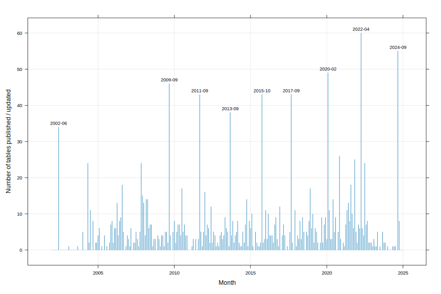
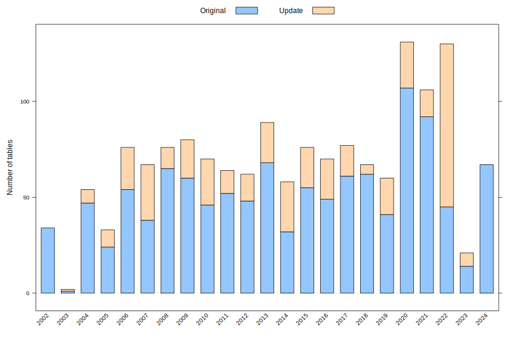

The [National Health and Nutrition Examination
Survey](https://www.cdc.gov/nchs/nhanes/about_nhanes.htm) (NHANES) is
a program of the National Center for Health Statistics (NCHS), which
is part of the US Centers for Disease Control and Prevention (CDC). It
measures the health and nutritional status of adults and children in
the United States in a series of surveys that combine interviews and
physical examinations.

Although the program began in the early 1960s, its structure was
changed in the 1990s.  Since 1999, the program has been conducted on
an ongoing basis, where a nationally representative sample 
of about 5,000 persons (across 15 counties) is examined each year,
with public-use data released in two-year cycles. This phase of the
program is referred to as [continuous
NHANES](https://wwwn.cdc.gov/nchs/nhanes/continuousnhanes/).

The NHANES interview includes demographic, socioeconomic, dietary, and
health-related questions. The examination component consists of
medical, dental, and physiological measurements, as well as laboratory
tests administered by highly trained medical personnel. Although the
details of the responses recorded vary from cycle to cycle, there is a
substantial amount of consistency, making it possible to compare data
across cycles.  Sampling weights are provided along with demographic
details for each participant; see the NHANES [analytic
guidelines](https://wwwn.cdc.gov/nchs/nhanes/analyticguidelines.aspx)
for details.


# Public-use data: web resources

NHANES makes a large volume of data available for download. However,
rather than a single download, these data are made available as a
number of separate SAS transport files, referred to as "data files" in
the NHANES ecosystem, for each cycle. Each such data file or table contains
records for several related variables. A comprehensive _manifest_ of data
files available for download is available
[here](https://wwwn.cdc.gov/Nchs/Nhanes/search/DataPage.aspx), along with
subsets broken up into the following "components": 
[Demographics](https://wwwn.cdc.gov/nchs/nhanes/search/datapage.aspx?Component=Demographics),
[Dietary](https://wwwn.cdc.gov/nchs/nhanes/search/datapage.aspx?Component=Dietary),
[Examination](https://wwwn.cdc.gov/nchs/nhanes/search/datapage.aspx?Component=Examination),
[Laboratory](https://wwwn.cdc.gov/nchs/nhanes/search/datapage.aspx?Component=Laboratory), and
[Questionnaire](https://wwwn.cdc.gov/nchs/nhanes/search/datapage.aspx?Component=Questionnaire).

For each data table listed in these manifests, a link to a "Doc File" (which
is an HTML webpage describing the data file) and a link to a SAS
transport file is provided. An additional list of limited access data
files are documented
[here](https://wwwn.cdc.gov/nchs/nhanes/search/datapage.aspx?Component=LimitedAccess),
but the corresponding data file download links are [not available](https://www.cdc.gov/rdc/index.htm).

An additional manifest of _variables_ is separately available for each component, and
gives more detailed information about both the variables and the data
files they are recorded in, although these tables do not provide
download links directly: 
[Demographics](https://wwwn.cdc.gov/nchs/nhanes/search/variablelist.aspx?Component=Demographics),
[Dietary](https://wwwn.cdc.gov/nchs/nhanes/search/variablelist.aspx?Component=Dietary),
[Examination](https://wwwn.cdc.gov/nchs/nhanes/search/variablelist.aspx?Component=Examination),
[Laboratory](https://wwwn.cdc.gov/nchs/nhanes/search/variablelist.aspx?Component=Laboratory),
[Questionnaire](https://wwwn.cdc.gov/nchs/nhanes/search/variablelist.aspx?Component=Questionnaire).

In addition, a [search interface](https://wwwn.cdc.gov/nchs/nhanes/search/) is also available.

For reasons [not
specified](https://wwwn.cdc.gov/nchs/nhanes/sasviewer.aspx), NHANES
releases data files as SAS transport files, and provides links to
proprietary Windows-only software that can supposedly be used to
convert these files to CSV files.


# Public-use data: R resources

One of the goals of the Epiconnector project is to provide and
document an alternative access path to NHANES data and documentation
_via_ the R ecosystem. It builds on the
[__nhanesA__](https://cran.r-project.org/package=nhanesA) R package,
along with utilities such as SQL databases and docker, to enable
efficient and reproducible analyses of NHANES data.

## The __nhanesA__ package

The [__nhanesA__](https://github.com/cjendres1/nhanes) package provides
a user-friendly interface to download and process data and
documentation files from the NHANES website. To use the utilities in
this package, we first need to know a few more details about how
NHANES data and documentation are structured.

Each available data file, which we henceforth call an NHANES _table_,
can be identified uniquely by a name. Generally speaking, each
public-use table has a corresponding data file (a SAS transport file,
with extension `xpt`) and a corresponding documentation file (a
webpage, with extension `htm`). The URLs from which these files can be
downloaded can usually be predicted from the table name, and the
_cycle_ it belongs to. Cycles are typically of 2-year duration,
starting from `1999-2000`.

Although there are exceptions, a table that is available for one cycle
will typically be available for other cycles as well, with a suffix
appended to the name of the table indicating the cycle. To make these
details concrete, let us use the `nhanesManifest()` function in the
__nhanesA__ package to download the [list of available
tables](https://wwwn.cdc.gov/nchs/nhanes/search/datapage.aspx) and
look at the names and URLs for the `DEMO` data files, which contain
demographic information and sampling weights for each study
participant.


```r
library(nhanesA)
manifest <- nhanesManifest("public") |> sort_by(~ Table)
subset(manifest, startsWith(Table, "DEMO"))
```

```
     Table                            DocURL                           DataURL     Years
368   DEMO   /Nchs/Nhanes/1999-2000/DEMO.htm   /Nchs/Nhanes/1999-2000/DEMO.XPT 1999-2000
367 DEMO_B /Nchs/Nhanes/2001-2002/DEMO_B.htm /Nchs/Nhanes/2001-2002/DEMO_B.XPT 2001-2002
366 DEMO_C /Nchs/Nhanes/2003-2004/DEMO_C.htm /Nchs/Nhanes/2003-2004/DEMO_C.XPT 2003-2004
364 DEMO_D /Nchs/Nhanes/2005-2006/DEMO_D.htm /Nchs/Nhanes/2005-2006/DEMO_D.XPT 2005-2006
365 DEMO_E /Nchs/Nhanes/2007-2008/DEMO_E.htm /Nchs/Nhanes/2007-2008/DEMO_E.XPT 2007-2008
369 DEMO_F /Nchs/Nhanes/2009-2010/DEMO_F.htm /Nchs/Nhanes/2009-2010/DEMO_F.XPT 2009-2010
370 DEMO_G /Nchs/Nhanes/2011-2012/DEMO_G.htm /Nchs/Nhanes/2011-2012/DEMO_G.XPT 2011-2012
371 DEMO_H /Nchs/Nhanes/2013-2014/DEMO_H.htm /Nchs/Nhanes/2013-2014/DEMO_H.XPT 2013-2014
372 DEMO_I /Nchs/Nhanes/2015-2016/DEMO_I.htm /Nchs/Nhanes/2015-2016/DEMO_I.XPT 2015-2016
373 DEMO_J /Nchs/Nhanes/2017-2018/DEMO_J.htm /Nchs/Nhanes/2017-2018/DEMO_J.XPT 2017-2018
375 DEMO_L /Nchs/Nhanes/2021-2022/DEMO_L.htm /Nchs/Nhanes/2021-2022/DEMO_L.XPT 2021-2023
            Date.Published
368 Updated September 2009
367 Updated September 2009
366 Updated September 2009
364 Updated September 2009
365         September 2009
369         September 2011
370   Updated January 2015
371           October 2015
372         September 2017
373          February 2020
375         September 2024
```

The __nhanesA__ package allows both data and documentation files to be
accessed, either by specifying their URL explicitly, or simply using
the table name, in which case the relevant URL is constructed from
it. For example,


```r
demo_b <- nhanesFromURL("/Nchs/Nhanes/2001-2002/DEMO_B.XPT", translated = FALSE)
demo_c <- nhanes("DEMO_C", translated = FALSE)
```


```r
str(demo_b[1:10])
```

```
'data.frame':	11039 obs. of  10 variables:
 $ SEQN    : num  9966 9967 9968 9969 9970 ...
 $ SDDSRVYR: num  2 2 2 2 2 2 2 2 2 2 ...
 $ RIDSTATR: num  2 2 2 2 2 2 2 2 2 1 ...
 $ RIDEXMON: num  2 1 1 2 2 2 1 2 1 NA ...
 $ RIAGENDR: num  1 1 2 2 1 2 1 2 1 1 ...
 $ RIDAGEYR: num  39 23 84 51 16 14 44 63 13 80 ...
 $ RIDAGEMN: num  472 283 1011 612 200 ...
 $ RIDAGEEX: num  473 284 1012 612 200 ...
 $ RIDRETH1: num  3 4 3 3 2 2 3 1 4 3 ...
 $ RIDRETH2: num  1 2 1 1 5 5 1 3 2 1 ...
```

```r
str(demo_c[1:10])
```

```
tibble [10,122 × 10] (S3: tbl_df/tbl/data.frame)
 $ SEQN    : int [1:10122] 21005 21006 21007 21008 21009 21010 21011 21012 21013 21014 ...
 $ SDDSRVYR: int [1:10122] 3 3 3 3 3 3 3 3 3 3 ...
 $ RIDSTATR: int [1:10122] 2 2 2 2 2 2 2 2 2 2 ...
 $ RIDEXMON: int [1:10122] 1 2 1 2 2 2 1 2 1 2 ...
 $ RIAGENDR: int [1:10122] 1 2 2 1 1 2 1 1 2 1 ...
 $ RIDAGEYR: int [1:10122] 19 16 14 17 55 52 0 63 13 3 ...
 $ RIDAGEMN: int [1:10122] 232 203 172 208 671 633 3 765 163 42 ...
 $ RIDAGEEX: int [1:10122] 233 205 172 209 672 634 4 766 164 42 ...
 $ RIDRETH1: int [1:10122] 4 4 3 4 3 3 1 4 4 4 ...
 $ RIDRETH2: int [1:10122] 2 2 1 2 1 1 3 2 2 2 ...
```

The data in these files appear as numeric codes, and must be
interpreted using codebooks available in the documentation files,
which can be parsed as follows.


```r
demo_b_codebook <-
    nhanesCodebookFromURL("/Nchs/Nhanes/2001-2002/DEMO_B.htm")
demo_b_codebook$RIDSTATR 
```

```
$`Variable Name:`
[1] "RIDSTATR"

$`SAS Label:`
[1] "Interview/Examination Status"

$`English Text:`
[1] "Interview and Examination Status of the Sample Person."

$`Target:`
[1] "Both males and females 0 YEARS -\r 150 YEARS"

$RIDSTATR
# A tibble: 3 × 5
  `Code or Value` `Value Description`               Count Cumulative `Skip to Item`
  <chr>           <chr>                             <int>      <int> <lgl>         
1 1               Interviewed Only                    562        562 NA            
2 2               Both Interviewed and MEC examined 10477      11039 NA            
3 .               Missing                               0      11039 NA            
```

```r
demo_b_codebook$RIAGENDR
```

```
$`Variable Name:`
[1] "RIAGENDR"

$`SAS Label:`
[1] "Gender"

$`English Text:`
[1] "Gender of the sample person"

$`Target:`
[1] "Both males and females 0 YEARS -\r 150 YEARS"

$RIAGENDR
# A tibble: 3 × 5
  `Code or Value` `Value Description` Count Cumulative `Skip to Item`
  <chr>           <chr>               <int>      <int> <lgl>         
1 1               Male                 5331       5331 NA            
2 2               Female               5708      11039 NA            
3 .               Missing                 0      11039 NA            
```

By default, the data access step converts the raw data into more
meaningful values using the corresponding codebook.


```r
demo_c <- nhanes("DEMO_C", translated = TRUE)
str(demo_c[1:10])
```

```
tibble [10,122 × 10] (S3: tbl_df/tbl/data.frame)
 $ SEQN    : int [1:10122] 21005 21006 21007 21008 21009 21010 21011 21012 21013 21014 ...
 $ SDDSRVYR: chr [1:10122] "NHANES 2003-2004 Public Release" "NHANES 2003-2004 Public Release" "NHANES 2003-2004 Public Release" "NHANES 2003-2004 Public Release" ...
 $ RIDSTATR: chr [1:10122] "Both Interviewed and MEC examined" "Both Interviewed and MEC examined" "Both Interviewed and MEC examined" "Both Interviewed and MEC examined" ...
 $ RIDEXMON: chr [1:10122] "November 1 through April 30" "May 1 through October 31" "November 1 through April 30" "May 1 through October 31" ...
 $ RIAGENDR: chr [1:10122] "Male" "Female" "Female" "Male" ...
 $ RIDAGEYR: int [1:10122] 19 16 14 17 55 52 0 63 13 3 ...
 $ RIDAGEMN: int [1:10122] 232 203 172 208 671 633 3 765 163 42 ...
 $ RIDAGEEX: int [1:10122] 233 205 172 209 672 634 4 766 164 42 ...
 $ RIDRETH1: chr [1:10122] "Non-Hispanic Black" "Non-Hispanic Black" "Non-Hispanic White" "Non-Hispanic Black" ...
 $ RIDRETH2: chr [1:10122] "Non-Hispanic Black" "Non-Hispanic Black" "Non-Hispanic White" "Non-Hispanic Black" ...
```

Further analysis can be performed on these resulting datasets which
are regular R data frames. Simple examples of such analyses, and other
functionality in the __nhanesA__ package such as search utilities are
described in [Ale et al, 2024](https://doi.org/10.1093/database/baae028).

## Limitations of this approach

The __nhanesA__ package is designed to access NHANES data on demand
from the CDC website. The efficiency of such an approach is naturally
limited by available bandwidth. Another limitation that is not obvious
at first glance is apparent when we try to combine data across
multiple cycles. Not all variables are measured in all cycles, and
even when they are, they may not be included in the same tables (and
sometimes they are included in multiple tables). Analyzing the
availability of variables of interest is difficult with the
rudimentary search facilities available on the NHANES website.

Another subtle issue that is important from the perspective of
reproducible research is the possibility of data updates (see
below). NHANES is an ongoing program, so new datasets are released on
a regular basis. More importantly from a reproducibility angle,
previously released datasets are sometimes updated. Older versions are
not retained on the NHANES website. This means that an analysis
performed on a given date may be impossible to recreate on a later
date, unless the relevant data sets have been retained.

# Efficient and and reproducible analyses of NHANES data

To address these limitations, we have developed several tools, each
building on the previous ones, to create a user-friendly platform for
analysts who are comfortable with R as a data analysis
platform. Briefly, 

- The [__cachehttp__](https://github.com/ccb-hms/cachehttp) package
  enables local cacheing of NHANES data and documentation files that
  are only re-downloaded if they have been updated.

- The [nhanes-snapshot](https://github.com/deepayan/nhanes-snapshot)
  repository is used to download and periodically update raw data (as
  compressed CSV files) and documentation (as HTML files) with
  timestamps, so that they can serve as a snapshot of NHANES data
  available on specific dates.

- The [nhanes-postgres](https://github.com/deepayan/nhanes-postgres)
  repository uses these snapshots to populate a
  [Postgresql](https://www.postgresql.org/) database inside a
  [Docker](https://www.docker.com/) container.
  
- The [__nhanesA__](https://github.com/cjendres1/nhanes) package has
  been modified to recognize the database when it is avilable, and use
  it as an alternative data source for both data and documentation,
  bypassing the NHANES website. Using __nhanesA__ in this mode leads
  to speedup of several orders of magnitude while requiring almost no
  change in user code.

- The [__phonto__](https://github.com/ainilaha/phonto) package
  provides more advanced analysis tools that take advantage of the
  local database.

The easiest way to get started with these tools is to run the
[nhanes-postgres](https://github.com/deepayan/nhanes-postgres) docker
image as described in the
[README](https://github.com/deepayan/nhanes-postgres/blob/main/README.md). In
addition to the Postgresql database, the container includes R and
RStudio Server along with versions of __nhanesA__ and __phonto__
configured to use the database. Once the included instance of RStudio
Server is accessed through a browser, one can use it as a regular R
session without the need to explicitly interact with the backend
database in any way. This is not, however, the only way, and advanced
users may prefer to use only the database from the container,
accessing it from outside via port forwarding.

Other articles on this site describe more detailed examples of
analyses using these tools, as well as other checks and utilities that
help with such analyses.


# Frequency of NHANES data releases

We conclude this document with a brief look at how frequently NHANES
data files are published and / or updated, based on the information
contained in the table manifest.

Recall from above that the NHANES table manifest includes a
`Date.Published` column.  This allows us to tabulate NHANES data
release dates. We expect that bulk releases of tables happen all
together, generally in two year intervals, while some tables may be
released or updated on a as-needed basis.

The release information (available by month of release) can be
summarized by tabulating the `Date.Published` field:

```r
xtabs(~ Date.Published, manifest) |> sort() |> tail(20)
```

```
Date.Published
        December 2007             July 2010             June 2020  Updated October 2014 
                   13                    13                    13                    14 
            July 2022           August 2021         December 2018         November 2007 
                   15                    17                    17                    17 
        November 2021 Updated November 2020              May 2004             June 2002 
                   18                    19                    21                    34 
       September 2011          October 2015        September 2013        September 2017 
                   37                    38                    38                    40 
       September 2009         February 2020        September 2024    Updated April 2022 
                   41                    48                    55                    59 
```

Parsing these dates systematically, we get


```r
pubdate <- manifest$Date.Published
updates <- startsWith(pubdate, "Updated")
datesplit <- strsplit(pubdate, split = "[[:space:]]")
datesplit[updates] <- lapply(datesplit[updates], "[", -1)
pub_summary <-
    data.frame(updated = updates,
               year = sapply(datesplit, "[[", 2) |> as.numeric(),
               month = sapply(datesplit, "[[", 1) |> factor(levels = month.name))
```

Although there are a few too many months, we can plot the number of
releases + updates by month as follows.


```r
pubfreq <- xtabs(~ interaction(month, year, sep = "-") + updated, pub_summary)
npub <- rowSums(pubfreq)
npub.date <- as.Date(paste0("01", "-", names(npub)), format = "%d-%B-%Y")
xyplot(npub ~ npub.date, type = "h", grid = TRUE,
       xlab = "Month", ylab = "Number of tables published / updated") +
    latticeExtra::layer(panel.text(x[y > 30], y[y > 30],
                                   format(x[y > 30], "%Y-%m"),
                                   pos = 3, cex = 0.75))
```




We can also plot the release / update frequency by year as follows.


```r
xtabs(~ year + updated, pub_summary) |>
    barchart(horizontal = FALSE, ylab = "Number of tables",
             auto.key = list(text = c("Original", "Update"), columns = 2),
             scales = list(x = list(rot = 45)))
```



A full table of number of releases by month is given by the following,
showing that there is at least one update almost every month.


```r
pubfreq0 <- pubfreq[rowSums(pubfreq) > 0, , drop = FALSE]
pubfreq0
```

```
                                   updated
interaction(month, year, sep = "-") FALSE TRUE
                     June-2002         34    0
                     February-2003      0    1
                     September-2003     1    0
                     January-2004       5    0
                     May-2004          21    3
                     June-2004          2    0
                     July-2004         10    1
                     September-2004     5    3
                     November-2004      2    0
                     December-2004      2    0
                     January-2005       3    1
                     February-2005      4    2
                     April-2005         1    0
                     June-2005          1    3
                     August-2005        1    0
                     October-2005       0    2
                     November-2005      7    0
                     December-2005      7    1
                     January-2006       2    0
                     February-2006      6    0
                     March-2006         3    3
                     April-2006         7    6
                     May-2006           2    2
                     June-2006          6    2
                     July-2006          8    1
                     August-2006       11    7
                     September-2006     4    1
                     November-2006      1    0
                     December-2006      4    0
                     January-2007       1    2
                     February-2007      1    0
                     March-2007         1    5
                     May-2007           1    1
                     June-2007          0    2
                     July-2007          2    3
                     August-2007        0    3
                     September-2007     0    1
                     October-2007       2    3
                     November-2007     17    7
                     December-2007     13    2
                     January-2008      12    1
                     February-2008      4    0
                     March-2008        12    2
                     April-2008        12    2
                     May-2008           4    2
                     June-2008          4    3
                     July-2008          7    0
                     August-2008        1    0
                     September-2008     2    1
                     October-2008       3    0
                     December-2008      4    0
                     January-2009       2    1
                     February-2009      1    0
                     March-2009         4    0
                     April-2009         4    0
                     May-2009           1    0
                     June-2009          1    4
                     July-2009          0    5
                     August-2009        1    1
                     September-2009    41    5
                     October-2009       3    1
                     December-2009      2    3
                     January-2010       8    0
                     February-2010      1    1
                     March-2010         5    0
                     April-2010         2    5
                     May-2010           2    5
                     June-2010          3    1
                     July-2010         13    4
                     August-2010        3    2
                     September-2010     6    1
                     October-2010       1    3
                     November-2010      2    2
                     March-2011         0    1
                     April-2011         0    3
                     June-2011          3    0
                     August-2011        2    1
                     September-2011    37    6
                     October-2011       4    1
                     November-2011      1    0
                     December-2011      5    0
                     January-2012      11    5
                     February-2012      3    1
                     March-2012         1    6
                     April-2012         6    0
                     May-2012           2    0
                     June-2012         12    0
                     July-2012          2    0
                     August-2012        4    1
                     September-2012     3    1
                     October-2012       1    0
                     November-2012      2    0
                     December-2012      1    0
                     January-2013       3    1
                     February-2013      4    1
                     March-2013         2    1
                     April-2013         2    2
                     May-2013           0    9
                     June-2013          3    3
                     July-2013          5    0
                     August-2013        0    1
                     September-2013    38    0
                     October-2013       2    2
                     November-2013      8    0
                     December-2013      1    1
                     January-2014       4    0
                     February-2014      3    2
                     March-2014         7    1
                     April-2014         1    1
                     May-2014           0    1
                     June-2014          1    0
                     July-2014          4    1
                     August-2014        1    1
                     September-2014     6    1
                     October-2014       0   14
                     November-2014      1    0
                     December-2014      4    4
                     January-2015       4    2
                     February-2015      4    6
                     March-2015         1    0
                     May-2015           0    5
                     June-2015          0    2
                     July-2015          1    0
                     August-2015        1    0
                     September-2015     1    1
                     October-2015      38    5
                     November-2015      2    0
                     December-2015      3    0
                     January-2016      10    1
                     February-2016      3    0
                     March-2016         7    3
                     April-2016         4    0
                     May-2016           3    1
                     June-2016          4    0
                     July-2016          2    0
                     August-2016        4    3
                     September-2016     5    4
                     October-2016       1    2
                     November-2016      0    1
                     December-2016      6    6
                     February-2017      3    1
                     March-2017         4    3
                     April-2017         4    0
                     June-2017          1    0
                     August-2017        1    4
                     September-2017    40    3
                     October-2017       2    0
                     December-2017      6    5
                     January-2018       1    0
                     February-2018      3    1
                     March-2018         3    0
                     April-2018         5    3
                     May-2018           3    0
                     June-2018          9    0
                     July-2018          5    0
                     September-2018     5    0
                     October-2018       4    0
                     November-2018      7    1
                     December-2018     17    0
                     January-2019       6    0
                     February-2019      4    6
                     March-2019         0    2
                     April-2019         5    1
                     May-2019           5    0
                     June-2019          1    1
                     August-2019        2    0
                     September-2019     9    0
                     October-2019       0    2
                     November-2019      3    4
                     December-2019      6    3
                     January-2020       2    1
                     February-2020     48    1
                     March-2020        11    0
                     April-2020         2    1
                     May-2020           3    0
                     June-2020         13    1
                     July-2020          5    0
                     August-2020        8    1
                     October-2020       5    0
                     November-2020      7   19
                     December-2020      3    0
                     February-2021      1    1
                     March-2021         0    1
                     April-2021         7    0
                     May-2021          10    1
                     June-2021         12    1
                     July-2021          8    0
                     August-2021       17    1
                     September-2021     9    1
                     October-2021       6    0
                     November-2021     18    7
                     December-2021      4    1
                     January-2022       2    0
                     February-2022      1    6
                     March-2022         6    0
                     April-2022         1   59
                     May-2022           1    5
                     June-2022          4    0
                     July-2022         15    9
                     August-2022        5    2
                     September-2022     8    0
                     October-2022       0    2
                     November-2022      2    0
                     December-2022      0    2
                     January-2023       1    0
                     February-2023      3    0
                     March-2023         1    0
                     April-2023         1    0
                     May-2023           2    3
                     July-2023          1    0
                     September-2023     3    2
                     October-2023       0    2
                     November-2023      2    0
                     January-2024       1    0
                     May-2024           1    0
                     June-2024          1    0
                     July-2024          1    0
                     September-2024    55    0
                     October-2024       8    0
```

# References

Laha Ale, Robert Gentleman, Teresa Filshtein Sonmez, Deepayan Sarkar,
Christopher Endres (2024). nhanesA: achieving transparency and
reproducibility in NHANES research. _Database_, Volume 2024, baae028,
<https://doi.org/10.1093/database/baae028>


