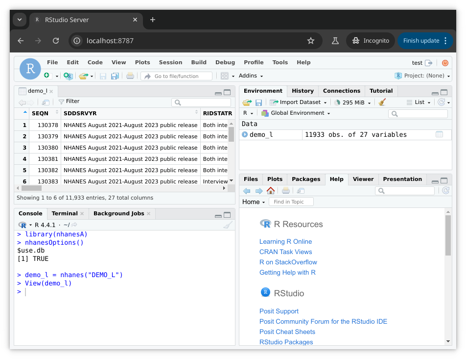

In its default mode of operation, functions in the __nhanesA__ package
scrape data directly from the CDC website each time they are invoked.
The advantage is simplicity; users only need to install the nhanesA
package without any additional setup.  However, the response time is
contingent upon internet speed and the size of the requested data.

As briefly described in the [introduction](nhanes-introduction.html),
__nhanesA__ has two alternative modes of operation where data can be
accessed from a local resource: (a) using a prebuilt SQL database, and
(b) using a mirror.

# Using SQL database

## Work in a Docker container

Functions in the __nhanesA__ package can obtain (most) data from a
suitably configured SQL database instead of accessing the CDC website
directly. The easiest way to obtain such a database is _via_ a Docker
image as described
[here](https://github.com/deepayan/nhanes-postgres).  This docker
image includes versions of R and RStudio, and is configured in a way
that causes __nhanesA__ to use the database when it is run inside the
docker instance. Once the docker container is up and running, one can
visit <http://localhost:8787/> to get access to an RStudio Server
instance.


After logging in using the credentials provided when initiating the
docker container, the user gets access to an RStudio session where the
__nhanesA__ package can be used to access NHANES resources.



From the user's perspective, the experience should be largely
identical to the default usage mode of __nhanesA__, except that the
data should become available without any significant delay. The output
of running `nhanesOptions()` indicates that __nhanesA__ was able to
detect a database when it was loaded.

## Access the database _via_ port forwarding

It is also possible to configure __nhanesA__ to use a SQL database
when running _outside_ a docker instance, provided the machine has
access to the database. Typically, such a database would be made
available by running a docker image on the same machine, or on another
machine in the local network, and have the host forward the port on
which Postgresql should be available (typically 5432) to the running docker
instance. This happens automatically if the
[instructions](https://github.com/deepayan/nhanes-postgres) to start
the docker instance are followed. The advantage of doing this is that a
single database instance can be used by multiple users in a local
network, avoiding making copies of the (large) database.

Using __nhanesA__ in this mode requires one additional step. To
indicate to the startup code in __nhanesA__ that a database is
available, one needs to define certain environment variables that give
details of the database that is available. Most of these environment
variables are optional, and to use the Postegresl backend, one only
needs to mandatorily specify the variable
`EPICONDUCTOR_CONTAINER_DB=postgres`. In case the Postgresql port
(5432) has been mapped to a different port on the host machine, this
needs to be indicated using `EPICONDUCTOR_DB_PORT=<port>`. If the
database is available on a different host, its address needs to be
specified using `EPICONDUCTOR_DB_SERVER=<host>`.

For the default invocation of `docker run`, and an R session running
on the same computer, the following is sufficient to use __nhanesA__
with the database.


```r
Sys.setenv(EPICONDUCTOR_CONTAINER_DB = "postgres")
library(nhanesA)
```

## Usage 

Once a database is successfully configured, the __nhanesA__ package
should ideally behave similarly whether or not a database is being
used. When a database is successfully found on startup, the package
sets a flag called `use.db` to `TRUE`.


```r
nhanesOptions()
```

```
$use.db
[1] TRUE
```

```r
system.time(d1 <- nhanes("DEMO_G"))
```

```
   user  system elapsed 
  0.305   0.024   0.331 
```

```r
str(d1[1:10])
```

```
tibble [9,756 × 10] (S3: tbl_df/tbl/data.frame)
 $ SEQN    : int [1:9756] 62161 62162 62163 62164 62165 62166 62167 62168 62169 62170 ...
 $ SDDSRVYR: chr [1:9756] "NHANES 2011-2012 public release" "NHANES 2011-2012 public release" "NHANES 2011-2012 public release" "NHANES 2011-2012 public release" ...
 $ RIDSTATR: chr [1:9756] "Both interviewed and MEC examined" "Both interviewed and MEC examined" "Both interviewed and MEC examined" "Both interviewed and MEC examined" ...
 $ RIAGENDR: chr [1:9756] "Male" "Female" "Male" "Female" ...
 $ RIDAGEYR: int [1:9756] 22 3 14 44 14 9 0 6 21 15 ...
 $ RIDAGEMN: int [1:9756] NA NA NA NA NA NA 11 NA NA NA ...
 $ RIDRETH1: chr [1:9756] "Non-Hispanic White" "Mexican American" "Other Race - Including Multi-Racial" "Non-Hispanic White" ...
 $ RIDRETH3: chr [1:9756] "Non-Hispanic White" "Mexican American" "Non-Hispanic Asian" "Non-Hispanic White" ...
 $ RIDEXMON: chr [1:9756] "May 1 through October 31" "November 1 through April 30" "May 1 through October 31" "November 1 through April 30" ...
 $ RIDEXAGY: int [1:9756] NA 3 14 NA 14 10 NA 6 NA 15 ...
```

Even when a database is available for use, it is possible to pause use
of the database and revert to downloading from the CDC website by
setting


```r
nhanesOptions(use.db = FALSE, log.access = TRUE)
```


The `log.access` option, if set, causes a message to be printed every
time a web resource is accessed.

With these settings, we get


```r
system.time(d2 <- nhanes("DEMO_G"))
```

```
Downloading: https://wwwn.cdc.gov/Nchs/Nhanes/2011-2012/DEMO_G.XPT
```

```
   user  system elapsed 
  0.792   0.111   6.915 
```

```r
str(d2[1:10])
```

```
'data.frame':	9756 obs. of  10 variables:
 $ SEQN    : num  62161 62162 62163 62164 62165 ...
 $ SDDSRVYR: num  7 7 7 7 7 7 7 7 7 7 ...
 $ RIDSTATR: Factor w/ 2 levels "Interviewed only",..: 2 2 2 2 2 2 2 2 2 2 ...
 $ RIAGENDR: Factor w/ 2 levels "Male","Female": 1 2 1 2 2 1 1 1 1 1 ...
 $ RIDAGEYR: num  22 3 14 44 14 9 0 6 21 15 ...
 $ RIDAGEMN: num  NA NA NA NA NA NA 11 NA NA NA ...
 $ RIDRETH1: Factor w/ 5 levels "Mexican American",..: 3 1 5 3 4 3 5 5 5 5 ...
 $ RIDRETH3: Factor w/ 6 levels "Mexican American",..: 3 1 5 3 4 3 5 6 5 6 ...
 $ RIDEXMON: Factor w/ 2 levels "November 1 through April 30",..: 2 1 2 1 2 2 1 1 1 1 ...
 $ RIDEXAGY: num  NA 3 14 NA 14 10 NA 6 NA 15 ...
```

The two versions may have minor differences in the order of rows and
columns, in whether they are tibbles or plain data frames, or in
whether categorical variables are represented as factors of character
strings. However, as long as the data has not been updated on the
NHANES website since it was downloaded for inclusion in the database,
the contents should be identical.


# Using a local mirror

A conceptually simple alternative that also avoids repetitive
downloads from the CDC website is to maintain a local mirror from
which the data and documentation files can be retrieved as needed.

As noted [here](nhanes-introduction.html), data and documentation URLs
for a particular table are determined by the table's name and the
cycle it represents. For example, the URLs for table `DEMO_C`, which
is from cycle 3, i.e., `2003-2004`, would be

- Data: <https://wwwn.cdc.gov/nchs/nhanes/2003-2004/DEMO_C.XPT>

- Documentation: <https://wwwn.cdc.gov/nchs/nhanes/2003-2004/DEMO_C.htm>

It is possible to change the "base" of the server from where
__nhanesA__ tries to download these files by setting an environment
variable called `NHANES_TABLE_BASE`, which defaults to the value
`"https://wwwn.cdc.gov"`.

The steps needed to create such a mirror is beyond the scope of this
document, but tools such as `wget`, or even the R function
`download.file()` in conjunction with the list of relevant URLs
obtained using `nhanesManifest()`, may be used to download all files
locally. Note that just downloading the files is not sufficient, and
they must also be made available through a HTTP server running
locally.


## Dynamic caching using __httpuv__ and __BiocFileCache__

Both the database and local mirroring options can get outdated when
CDC releases new files or updates old ones. The
[__BiocFileCache__](https://bioconductor.org/packages/release/bioc/html/BiocFileCache.html)
package can cache downloaded files locally in a persistent manner,
updating them automatically when the source file has been updated. The
experimental [__cachehttp__](https://github.com/ccb-hms/cachehttp) package
uses the __BiocFileCache__ package in conjunction with the
[httpuv](https://github.com/rstudio/httpuv/#readme) package to run a
local server that downloads files from the CDC website the first time
they are requested, but uses the cache for subsequent requests.

To use this package, first install it using

```r
BiocManager::install("BiocFileCache")
remotes::install_github("ccb-hms/cachehttp")
```

Then, run the following in a separate R session.

```r
require(cachehttp)
add_cache("cdc", "https://wwwn.cdc.gov",
          fun = function(x) {
              x <- tolower(x)
              endsWith(x, ".htm") || endsWith(x, ".xpt")
          })
s <- start_cache(host = "0.0.0.0", port = 8080,
                 static_path = BiocFileCache::bfccache(BiocFileCache::BiocFileCache()))
## stopServer(s) # to stop the httpuv server
```

This session must be kept active for the server to work. It can even
run on a different machine, as long as it is accessible via the
specified port. It does not require the __nhanesA__ package to work.

While the server is running, we can set (in a different R session)


```r
Sys.setenv(NHANES_TABLE_BASE = "http://127.0.0.1:8080/cdc")
```

(changing host IP and port as necessary) to use this server instead of
the primary CDC website to serve `XPT` and `htm` files. Although the
each file is downloaded from the CDC website the first time it is
requested, subsequent "downloads" should be faster.

# Session information


```r
print(sessionInfo(), locale = FALSE)
```

```
R Under development (unstable) (2024-07-12 r86893)
Platform: x86_64-pc-linux-gnu
Running under: Debian GNU/Linux 12 (bookworm)

Matrix products: default
BLAS/LAPACK: /usr/lib/x86_64-linux-gnu/openblas-pthread/libopenblasp-r0.3.21.so;  LAPACK version 3.11.0

attached base packages:
[1] stats     graphics  grDevices utils     datasets  methods   base     

other attached packages:
[1] nhanesA_1.1.4    kableExtra_1.4.0 lattice_0.22-6   knitr_1.45      

loaded via a namespace (and not attached):
 [1] utf8_1.2.4        generics_0.1.3    xml2_1.3.6        stringi_1.8.4    
 [5] hms_1.1.3         digest_0.6.33     magrittr_2.0.3    evaluate_0.23    
 [9] grid_4.5.0        timechange_0.2.0  fastmap_1.2.0     blob_1.2.4       
[13] plyr_1.8.9        jsonlite_1.8.8    processx_3.8.3    chromote_0.1.2   
[17] RPostgres_1.4.6   DBI_1.2.1         ps_1.7.5          promises_1.2.1   
[21] httr_1.4.7        rvest_1.0.4       selectr_0.4-2     purrr_1.0.2      
[25] fansi_1.0.6       viridisLite_0.4.2 scales_1.3.0      codetools_0.2-20 
[29] cli_3.6.3         rlang_1.1.4       dbplyr_2.5.0      bit64_4.0.5      
[33] munsell_0.5.0     tools_4.5.0       dplyr_1.1.4       colorspace_2.1-0 
[37] curl_5.2.3        vctrs_0.6.5       R6_2.5.1          lifecycle_1.0.4  
[41] lubridate_1.9.3   stringr_1.5.1     bit_4.0.5         foreign_0.8-86   
[45] pkgconfig_2.0.3   pillar_1.9.0      later_1.3.2       glue_1.7.0       
[49] Rcpp_1.0.12       systemfonts_1.0.5 tidyselect_1.2.1  tibble_3.2.1     
[53] xfun_0.41         rstudioapi_0.15.0 htmltools_0.5.7   websocket_1.4.1  
[57] rmarkdown_2.28    svglite_2.1.3     compiler_4.5.0   
```


